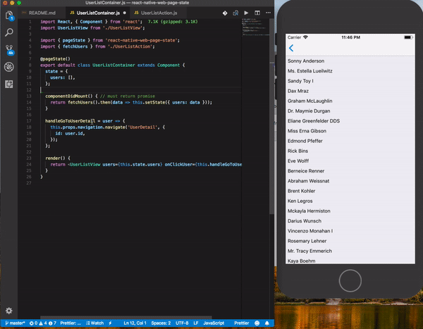

# React Native Web Page State

Handling loading, error, and success callback information out of the box!



## Instalation
````bash
npm install react-native-web-page-state --save
````

## Run Example

````bash
cd examples/page-state
npm install
npm run ios
````

## Example
````javascript
import React from 'react';
import { ScrollView, View } from 'react-native';

import { pageState, withPageStateProvider } from 'react-native-web-page-state';
import pageStateConfig from './config/pageState';

@withPageStateProvider(pageStateConfig)
@pageState()
export class UserList extends React.Component {


  /*
   * @returns {Promise} - must return promise
   **/
  @pageState({
    loading: 'modal.loading',
    error: ['page.error', 'snackbar.error'],
    success: {
      path: 'snackbar.success',
      payload: {
        textMessage: 'Success fetch users',
      },
    }
  })
  componentDidMount() {
    return fetchUserList();
  }

  render() {
    return (
      <FlatList
        data={this.state.data}
        renderItem={this.renderItem}
      />
    )
  }
}

export default class App extends React.Component {
  render() {
    return (
      <View>
        <UserList />
      </View>
    );
  }
}
````

````javascript
// config/pageState.js

import SnackbarError from '../components/Snackbar/Error';
import SnackbarSuccess from '../components/Snackbar/Success';

import PageLoading from '../components/Page/Loading';
import PageError from '../components/Page/Error';

import ModalLoading from '../components/Modal/Loading';

const config = {
  page: {
    loading: PageLoading,
    error: PageError,
  },
  modal: {
    loading: ModalLoading,
  },
  snackbar: {
    error: SnackbarError,
    success: SnackbarSuccess,
  },
}

export default config;
````